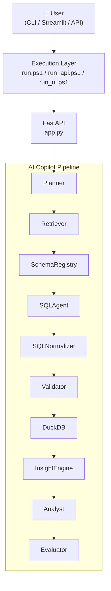
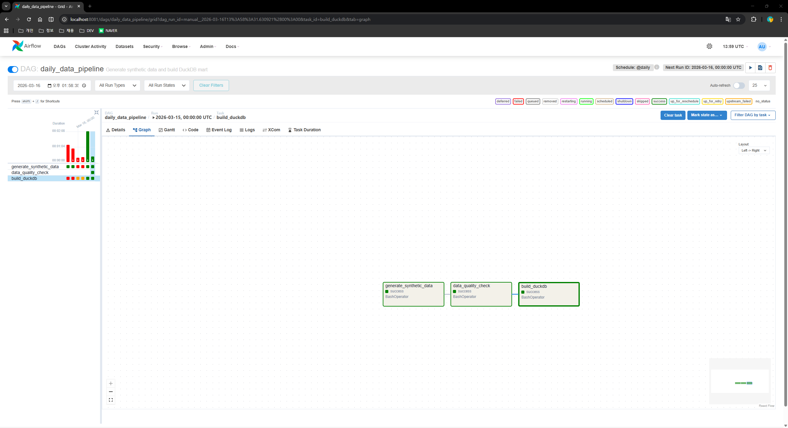
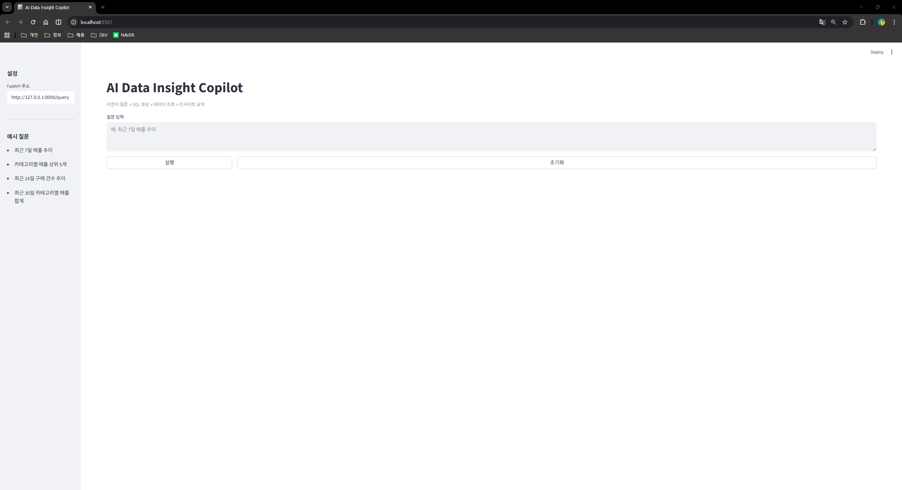
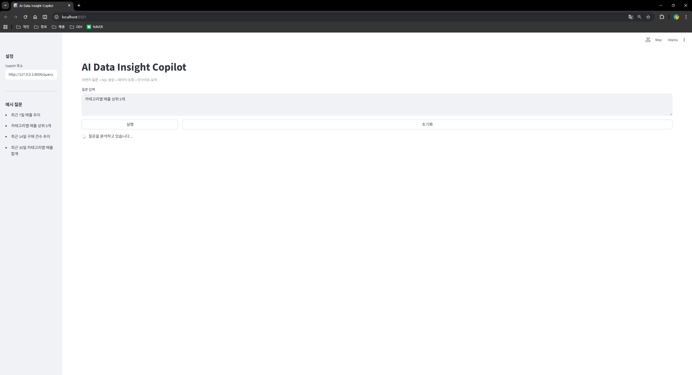
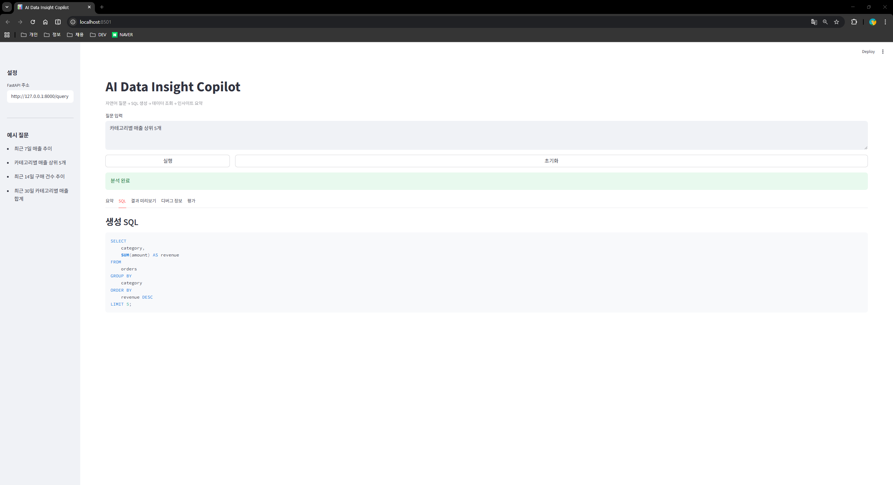
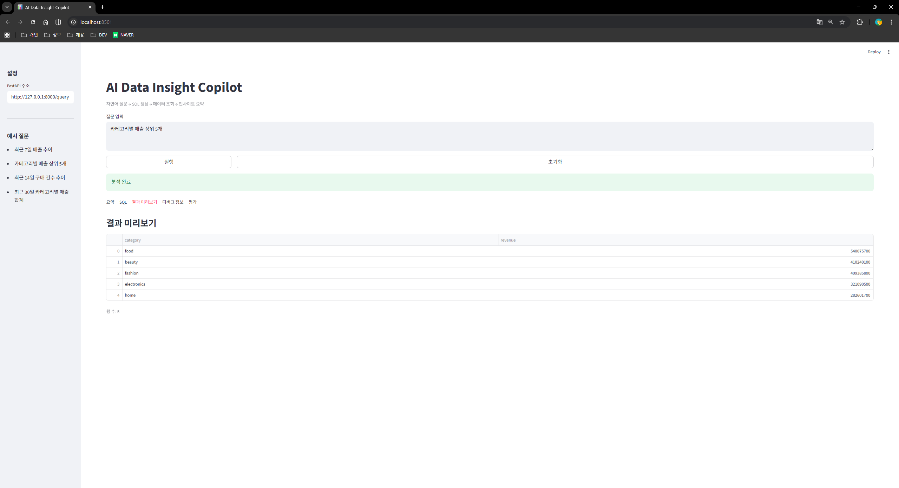
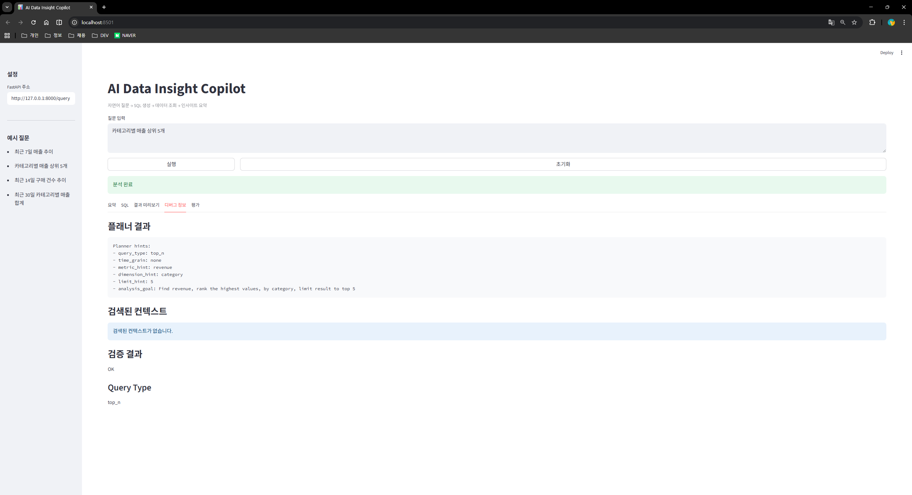
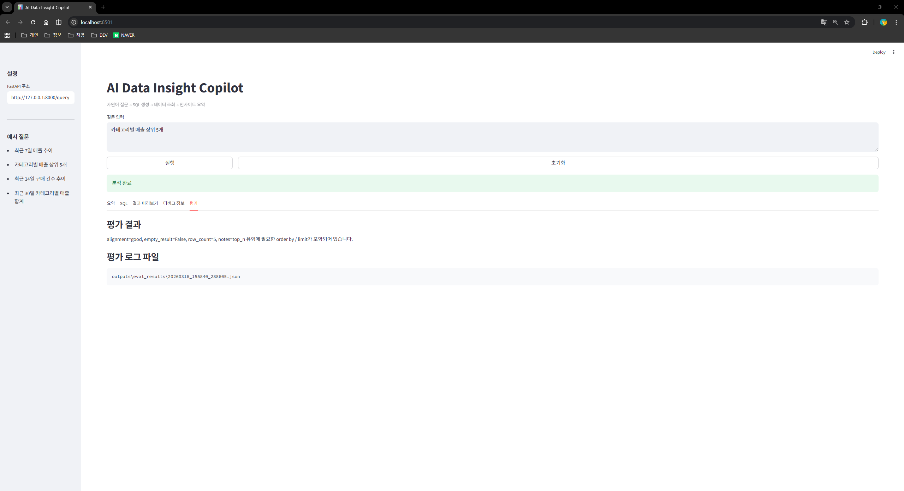
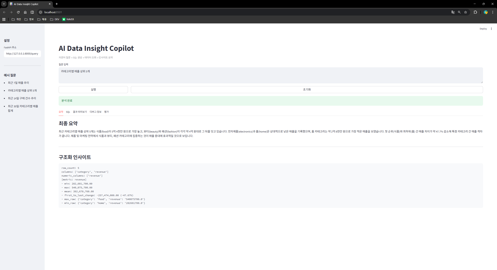
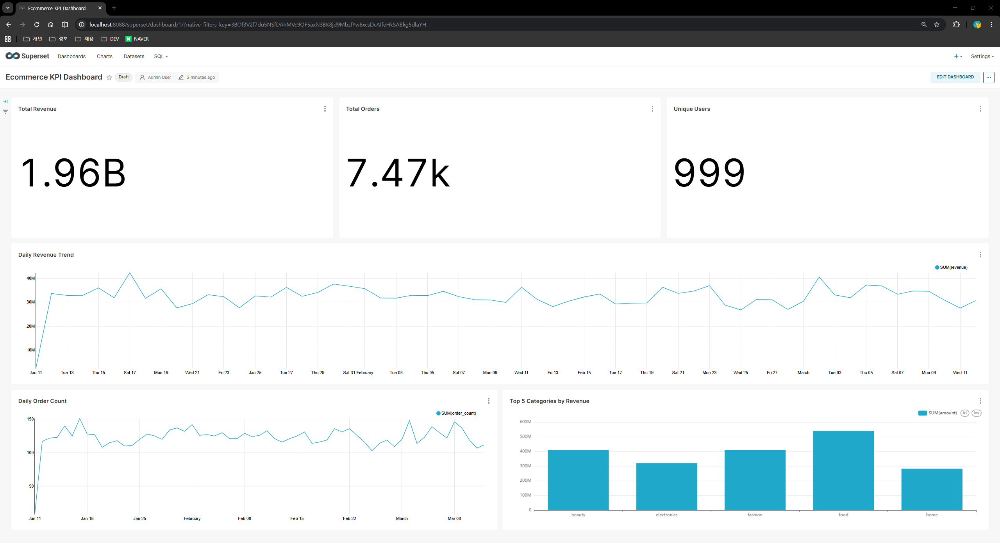

# 🤖 AI Data Insight Copilot

AI Data Insight Copilot is an AI-native analytics system that allows non-technical users to query data using natural language and receive business insights instantly.

> Natural language 기반으로 SQL 생성부터 인사이트 도출까지 자동화한 AI 데이터 분석 Copilot 시스템

---

## Key Highlights

- Natural Language → SQL → Insight end-to-end automation
- Multi-stage LLM pipeline with validation & retry
- Metadata-driven design to reduce hallucination
- Production-oriented architecture (FastAPI, DuckDB, Airflow)

---

## 1. Motivation

실제 업무에서 반복적인 데이터 조회 요청과 SQL 작성 작업을 경험하며 비개발자가 데이터에 접근하기 어려운 구조를 개선하고자 본 프로젝트를 시작했습니다.

---

## 2. Problem Definition

데이터 분석 과정에서 반복적으로 발생하는 문제는 다음과 같습니다.

- SQL 작성에 대한 높은 진입 장벽
- 데이터 스키마를 모르면 분석 자체가 어려움
- 동일한 KPI를 반복적으로 계산하는 비효율
- 분석 결과를 비즈니스 관점으로 해석해야 하는 추가 작업

특히 운영 환경에서는 비개발자(운영자, PM 등)가 데이터 조회를 위해 개발자에게 의존하는 문제가 발생합니다.

이 프로젝트는 이러한 문제를 해결하기 위해 자연어 기반 데이터 분석 시스템(AI Copilot)을 설계하고 구현하는 것을 목표로 합니다.

---

## 3. Project Overview

**AI Data Insight Copilot**은 자연어로 데이터를 분석할 수 있는 미니 데이터 플랫폼입니다.

| Feature | Description |
|---|---|
| 🗣️ Natural Language → SQL | 자연어 질문을 SQL로 자동 변환 |
| 🔄 Automated ETL Pipeline | 데이터 생성 → 검증 → 적재 자동화 |
| 🦆 DuckDB Data Mart | 분석용 경량 데이터 마트 구성 |
| 💡 Insight Generation | LLM 기반 비즈니스 인사이트 추출 |
| 🌐 API / Web UI | FastAPI + Streamlit 인터페이스 제공 |
| ⏱️ Airflow Orchestration | DAG 기반 파이프라인 자동 스케줄링 |

**사용자 흐름**: 자연어 질문 입력 → SQL 생성 → 데이터 조회 → 인사이트 생성 → 비즈니스 요약 제공

**Target Users**: 데이터 분석 요청을 자주 하는 운영자 / PM / 비개발자

---

## 4. Architecture

본 시스템은 단일 LLM 호출이 아닌, multi-stage agent 기반 파이프라인으로 설계되었습니다.



---

## 5. Project Structure

```
AI-DATA-INSIGHT-COPILOT/
├── airflow/
│   └── dags/
│       └── daily_data_pipeline.py       # Airflow ETL DAG 정의
├── data/
│   ├── processed/                        # 전처리된 데이터
│   └── raw/                              # 원본 합성 데이터 (CSV)
├── metadata/
│   ├── business/
│   │   ├── kpi_definitions.json          # KPI ↔ SQL 집계 매핑
│   │   └── sql_examples.json             # 자연어 → SQL few-shot 예시
│   └── schema/
│       └── tables.json                   # LLM에 노출할 테이블 정의
├── outputs/
│   └── eval_results/                     # SQL 실행 평가 로그
├── scripts/
│   ├── build_duckdb.py                   # CSV → DuckDB 적재 및 마트 생성
│   ├── data_quality_check.py             # 데이터 품질 검증
│   ├── generate_synthetic_data.py        # e-commerce 합성 데이터 생성
│   ├── run.ps1                           # CLI 실행
│   ├── run_api.ps1                       # API 서버 실행
│   └── run_ui.ps1                        # Streamlit UI 실행
├── src/copilot/
│   ├── agents/
│   │   ├── analyst.py                    # 비즈니스 인사이트 분석
│   │   ├── insight_engine.py             # 구조화된 인사이트 생성
│   │   ├── planner.py                    # 질문 의도 분류 및 실행 계획 수립
│   │   ├── sql_agent.py                  # SQL 생성
│   │   ├── sql_normalizer.py             # SQL 정규화
│   │   └── validator.py                  # SQL 유효성 검증 및 retry
│   ├── context/
│   │   └── schema_registry.py            # 허용 테이블 스키마 관리
│   ├── datastore/
│   │   └── duckdb_client.py              # DuckDB 연결 및 쿼리 실행
│   ├── evaluation/
│   │   └── evaluator.py                  # 결과 평가 및 로깅
│   ├── interfaces/
│   │   ├── api/                          # FastAPI 앱 (app.py, schemas.py)
│   │   └── web/                          # Streamlit UI (streamlit_app.py)
│   ├── pipeline/
│   │   └── orchestrator.py               # 전체 파이프라인 조율
│   ├── retrieval/
│   │   └── retriever.py                  # 메타데이터 기반 few-shot 검색
│   └── main.py                           # CLI 진입점
├── .env.example
├── .gitignore
├── docker-compose.airflow.yml
├── README.md
└── requirements.txt
```

---

## 6. Data Pipeline (ETL)

```
generate_synthetic_data.py → data_quality_check.py → build_duckdb.py
```

| Script | Role |
|---|---|
| `generate_synthetic_data.py` | 사용자 / 상품 / 이벤트 / 주문 합성 데이터 생성 |
| `data_quality_check.py` | null 검증, 이벤트 타입 검증, 이상 탐지 |
| `build_duckdb.py` | CSV → DuckDB 적재 및 분석 마트 생성 |

**생성 테이블**

| Layer | Tables |
|---|---|
| raw | `users`, `products`, `events`, `orders` |
| mart | `mart_daily_revenue`, `mart_funnel_daily` |

---

## 7. Metadata Design

| File | Role |
|---|---|
| `tables.json` | LLM에 노출할 테이블 정의 (전체 DB가 아닌 제한된 인터페이스 제공) |
| `kpi_definitions.json` | KPI ↔ SQL 집계 로직 매핑 |
| `sql_examples.json` | 자연어 → SQL 패턴 매핑 (few-shot retrieval 역할) |

> **Design Principle**: Schema / KPI / Query pattern을 파일로 분리하여 LLM 자유도를 제한함으로써 hallucination을 최소화하고 안정성을 확보합니다.

---

## 8. AI Copilot Pipeline

```
User Question
  → Planner        : 질문 의도 분류 및 실행 계획 수립
  → Retriever       : 메타데이터 기반 few-shot 예시 검색
  → SchemaRegistry  : 허용 테이블 스키마 조회
  → SQLAgent        : SQL 생성
  → SQLNormalizer   : SQL 정규화
  → Validator       : 유효성 검증 + retry loop
  → DuckDB          : 쿼리 실행
  → InsightEngine   : 구조화된 인사이트 추출
  → Analyst         : 비즈니스 요약 생성
  → Evaluator       : 결과 평가 및 로깅
```

**Key Features**
- Multi-stage LLM pipeline으로 단일 호출 대비 정확도 향상
- SQL validation + retry loop으로 오류 자동 복구
- Metadata-driven generation으로 hallucination 최소화
- 단계별 구조화된 evaluation logging

---

## 9. Execution

### CLI
```powershell
./scripts/run.ps1
```

### API Server
```powershell
./scripts/run_api.ps1
```

- Endpoint: `POST /query`
- URL: `http://127.0.0.1:8000`

**Request**
```json
{ "question": "최근 7일 매출 추이" }
```

**Response**
```json
{
  "sql": "...",
  "summary": "...",
  "preview": "...",
  "evaluation_summary": "..."
}
```

### Web UI (Streamlit)
```powershell
./scripts/run_ui.ps1
```

SQL 결과, 디버그 정보, 평가 결과를 인터랙티브하게 확인 가능

---

## 10. Airflow (Orchestration)

```powershell
docker-compose -f docker-compose.airflow.yml up
```

**DAG Flow**
```
generate_synthetic_data → data_quality_check → build_duckdb
```

| Component | Role |
|---|---|
| Postgres | Airflow 메타데이터 DB |
| Airflow Webserver | DAG 모니터링 UI |
| Airflow Scheduler | DAG 자동 스케줄링 |
| airflow-init | 초기 환경 설정 |

순차 실행 보장 및 실패 시 downstream 태스크 자동 차단

---

## 11. Why Agent-based Architecture

단일 LLM 호출 방식 대신 multi-stage agent 구조를 선택했습니다.

| Agent | 역할 | 효과 |
|---|---|---|
| Planner | 질문 구조화 | SQL 정확도 향상 |
| Retriever | SQL 패턴 제공 | hallucination 감소 |
| Validator | 실행 전 검증 | 안전성 확보 |
| Retry loop | 자동 오류 복구 | 안정성 향상 |
| Insight Engine | 결과 해석 구조화 | 비즈니스 가치 전달 |

이 구조를 통해 단순 응답 시스템이 아니라 신뢰 가능한 분석 시스템으로 확장할 수 있도록 설계했습니다.

---

## 12. Key Design Decisions

### ✅ Controlled Text2SQL

전체 DB를 LLM에 노출하지 않고 허용된 테이블만 사용하도록 제한했습니다.

이렇게 설계한 이유:
- 불필요한 JOIN 생성 방지
- 잘못된 테이블 참조 감소
- SQL 생성 안정성 확보

### ✅ Multi-stage Pipeline

단일 LLM 호출 대신 `Planner → Validator → Retry` 구조로 설계했습니다.

이렇게 설계한 이유:
- 단일 호출은 복잡한 질문에서 오류율이 높음
- 단계별 검증으로 오류를 조기에 감지
- Retry loop으로 일시적 실패 자동 복구

### ✅ Metadata-driven Design

Schema / KPI / SQL 패턴을 별도 파일로 분리했습니다.

이렇게 설계한 이유:
- LLM 코드 수정 없이 테이블·KPI 추가 가능
- 분석 도메인 변경 시 메타데이터만 교체
- 유지보수 비용 최소화

### ✅ LLM Safety

SQL validation, forbidden query 차단, retry loop을 적용했습니다.

이렇게 설계한 이유:
- DROP / DELETE 등 위험 쿼리 실행 방지
- 문법 오류 SQL이 DB에 도달하지 않도록 차단
- 운영 환경 수준의 안전성 확보

---

## 13. Limitations & Future Work

- [ ] KPI 정의 확장
- [ ] Vector DB 기반 semantic retrieval 도입
- [ ] Query 최적화
- [ ] 실시간 데이터 연동
- [ ] Monitoring / Alerting 시스템 구축

---

## 14. Screenshots

### Airflow — DAG Pipeline
> `daily_data_pipeline` DAG의 3단계 순차 실행 및 성공 상태



---

### Streamlit Copilot — Web UI

**① Main Screen** — 자연어 질문 입력 및 예시 질문 제공


**② Analyzing** — 파이프라인 실행 중 상태


**③ SQL Tab** — 자연어로부터 생성된 SQL 확인


**④ Result Preview Tab** — 쿼리 실행 결과 테이블


**⑤ Debug Tab** — Planner 분석 결과 및 검증 정보


**⑥ Evaluation Tab** — SQL 평가 결과 및 로그 파일 경로


**⑦ Summary Tab** — 최종 비즈니스 요약 및 구조화 인사이트


---

### Superset — Ecommerce KPI Dashboard
> Total Revenue / Total Orders / Unique Users KPI 카드, Daily Revenue Trend, Top 5 Categories by Revenue



---

## 15. Impact

이 프로젝트를 통해 다음을 달성했습니다.

| 설계 | 효과 |
|---|---|
| Validation + Retry 구조 적용 | SQL 실행 실패 자동 복구 → 안정적인 쿼리 실행 보장 |
| Metadata 기반 schema 제한 | 잘못된 테이블 참조 방지 → hallucination 감소 |
| Planner 기반 SQL 생성 | 복잡한 질문에도 구조적 대응 가능 |
| 자연어 입력 인터페이스 | 비개발자도 데이터 조회 가능 → 개발자 의존도 감소 |

결과적으로 단순한 Text2SQL 데모가 아니라 운영 환경에서 활용 가능한 AI 기반 데이터 분석 시스템을 설계했습니다.

---

## 16. Author

**Jina**
